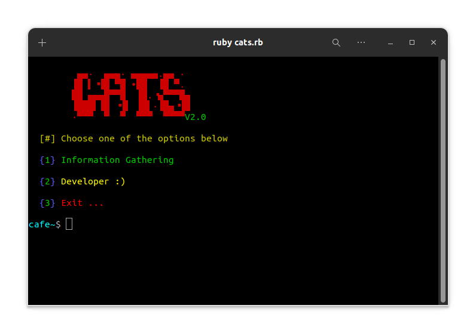

# cats
tool to use webhacking with ruby 

## PreView

<pre>

</pre>

## Operating Systems Tested
- Kali Linux 2021
- Windows 11
- Ubuntu 22.04
- MacOs
- ## Install
```bash
git clone https://github.com/nimacpp/cats.git
cd cats
sudo bundle install
ruby cats.rb 
```
### Contact us
- email : nima.cpp@outlook.com
